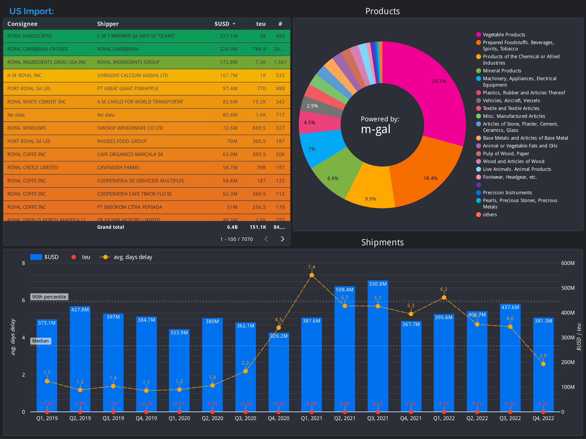

<p align="center">
    
</p>

---
## Objective.
We want to be an owner of a tool which will have been giving us a possibility to get
the all-accessible historical information about importing – exporting operations related
with particular company in a short time and in a convenient and smart form.
Also this tool should be capable to uncover & derive all relationships, communities, hidden connections and
its quality score assessment for any particular company.


## Data.
Initially we have a [Bills of Lading](https://en.wikipedia.org/wiki/Bill_of_lading) dataset
for some number of latest years with a total number of records more than 59M and the average amount of
records per month around 1.2M.

##### Raw sample for some meaningfull data fields:
| Column name               | Raw content example
|---------------------------|---------------------------
| day                       | 8
| month                     | 1
| year                      | 2022
| Estimate Arrival Date     | 20211208
| Actual Arrival Date       | 20220107
| Bill of Lading            | MAEU213132756
| Carrier SASC Code         | MAEU, MAERSK LINES, INC.
| Vessel Code               | 9213583
| Vessel Name               | E.R. FELIXSTOWE
| Loading Port              | 57078, YANTIAN
| Unloading Port            | 3001, SEATTLE, WA
| Country                   | TH, THAILAND
| Weight in KG              | 44012.35
| TEU                       | 7.5
| Quantity                  | 3879
| Container Id              | SUDU6989315,TCKU6779542,GESU6008873,MRKU2397436,SUDU6804704
| Shipper Name              | SUMITOMO RUBBER THAILAND CO LTD
| Shipper Address           | 7/232 MOO 6 TAMBOL MABYANGPORN AMPHUR PLUAKDAENG RAYONG 21140 THAILAND
| Consignee Name            | LES SCHWAB WAREHOUSE CENTER
| Consignee Address         | 20900 COOLEY RD BEND OR 97701-3406
| Notify Party Name         | OMNI UNITED S PTE LTD
| Notify Party Address      | 4 SHENTON WAY 08-02 SGX CENTRE 2 SINGAPORE 068807
| Product Desc              | NEW RADIAL TIRES NEW BIAS PLY TIRES ENTIRELY MANUFACTURED IN THAILAND AS DESCRIPBED IN THEAPPLICANT S PURCHASE ORDER (29383, 29384)


## Challenge.
  - Enormous data amount. And data is messy.
  - Huge counts of NA’s. It is around 40%.
  - Tremendous amount of textual data such as long cargo’s descriptions, addresses and also heap of categorical features with the extremely high cardinality.
  - The records have not standard formatting, only the names of columns (entities) are standard. Therefore, the same entity such as a name of consignee \ shipper \ vessel \ port or location can take huge of different representations and in some cases could be matched to the single entity only by human brain. It is a super challenge – to standardize (deduplicate) a such data.
  - The absentness of dedicated field for the HS Codes. And moreover, the absentness of any duty to note the HS Codes in the cargo’s textual description at least in any free manner. Due this only 37% of cargo descriptions contains a HS Codes, and even these codes’ representations may be very messy and dirty.


## Approach & workflow.
1. We will use a fuzzy matching algorithms for some variables to get additional info from the data
we already have. Vessels names, Ports etc.
2. With the NGRAMS NLP technics will do grouping (roll in) the similar consignees & shippers names and its addresses.
> _* Theoretically for the grouping of the entities (NER - Names Entities Recognition)
it is possible to use the [Dedupe package](https://github.com/dedupeio),
but in the our case it would take around 1000 days of calculating.
3. Using a web-scraping will get the 4-digits HS codes and its descriptions.
With the _regex_ will extract & map the HS codes with the raw cargos descriptions.


## Graph.
With a bulk import we will push prepared data into the brandnew graph DB provided
by [Neo4j GraphDB](https://neo4j.com/).
the minimal but powerfull graph schema could be look like:
<p align="center">

</p>

Eventually, to derive the all power of the data we got we will use a
__Graph Data Science algorithms__:\
__Centrality__ algorithms are used to determine the importance of distinct nodes in a network.
It assumes the scores like PageRank, Degree, Betweenness and Closeness.
<p align="center">

</p>

__Communities detection__ algorithms are used to evaluate how groups of nodes are clustered
or partitioned, as well as their tendency to strengthen or break apart.
<p align="center">
    
</p>

__Path finding__ algorithms find the path between two or more nodes or evaluate
the availability and quality of paths.
<p align="center">

</p>

__Similarity__ algorithms compute the similarity of pairs of nodes based on their
neighborhoods or their properties. Several similarity metrics can be used
to compute a similarity score.
<p align="center">

</p>


## Dashboard.
Also based on the flat data we were able to build an interactive analytical dashboard.
<p align="center">





</p>

----
#### Project's folders structure.
_Some folders may be missing (marked by *)due project's particular aim._
```
mg-bol (root project's folder)
├── data             <- Contains data sources for project.
│   ├── deduped      <- Sub-data containing deduped Entity Names and its addresses.
│   ├── processed    <- Preprocessed (cleaned) data for a further work.
│   └── raw          <- The immutable raw input BoL data.
├── media            <- Pictures for docs and README.
├── reports          <- Contains generated analysis as HTML, PDF, LaTeX, Excel and etc.
└── src              <- Source code, scripts for use in this project.
    ├── bol          <- Scripts to acquire, explore, preclean and process BoL data.
    ├── neo4j        <- Scripts to work with the Neo4j Graph DB
    │   ├── cypher   <- Cypher language statements needed to interact w/ Graph DB.
    │   ├── gds      <- Graph Data Science algorithms in code.
    │   └── import   <- Code to provide bulk data import into new Neo4j DB instance.
    ├── sql          <- Contains SQL scripts for project.
    └── superset     <- Contains configs for Apache Superset Dashboard.
```
